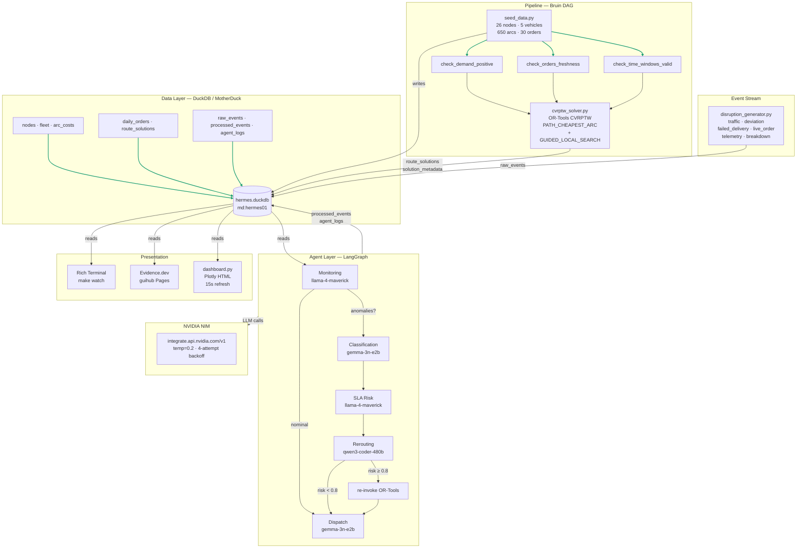

# HERMES

**Hierarchical Execution & Routing for Multi-agent Enterprise Supply-chain**

> An event-driven AI logistics platform that pairs classical Operations Research with a multi-agent LLM decision layer — built to demonstrate that mathematical optimisation and AI agents solve real problems together, not as replacements for each other.

[](https://yusuuf-mm.github.io/hermes/)
[](#testing)
[](#tech-stack)
[](#)

---

## Table of Contents

- [What HERMES Is](#what-hermes-is)
- [Live Demo](#live-demo)
- [The Problem](#the-problem)
- [System Architecture](#system-architecture)
- [Mathematical Formulation](#mathematical-formulation)
- [The Five-Agent Pipeline](#the-five-agent-pipeline)
- [Data Schema](#data-schema)
- [Tech Stack](#tech-stack)
- [Project Structure](#project-structure)
- [Quickstart](#quickstart)
- [Running the Full Pipeline](#running-the-full-pipeline)
- [Dashboard](#dashboard)
- [Testing](#testing)
- [Configuration](#configuration)
- [Design Decisions](#design-decisions)
- [Known Issues & Next Steps](#known-issues--next-steps)

---

## What HERMES Is

HERMES is a three-layer AI systems engineering project built on a Lagos metropolitan delivery network:

| Layer | Technology | Role |
|---|---|---|
| **Data & Orchestration** | Bruin + DuckDB/MotherDuck | Pipeline DAG, quality checks, schema governance |
| **Operations Research** | OR-Tools CVRPTW | Provably optimal route planning |
| **Multi-Agent Intelligence** | LangGraph + NVIDIA NIM | Real-time disruption response and dispatch |

The core architectural thesis: **LLMs decide when and how to invoke the solver — they never replace it.** OR-Tools is the authoritative decision engine for route mathematics. Agents handle everything around it: monitoring the event stream, classifying disruptions, estimating SLA risk, deciding whether re-optimisation is warranted, and communicating the outcome to human operators.

---

## Live Demo

### Agent Telemetry — Mission Control Terminal

<!-- Add GIF: assets/hermes_telemetry.gif -->
> Record with ScreenToGif (Windows, free): capture a 30–45s session showing ticks advancing, SLA risk climbing, and a re-solve triggering. Save to `assets/hermes_telemetry.gif`.

The Rich terminal control room fires the full five-agent chain on every tick. Watch the SLA risk score climb as disruptions accumulate — when it crosses `0.8`, OR-Tools re-solves automatically and new routes appear in the fleet panel.

```bash
make watch    # starts the continuous agent loop
```

### Operations Dashboard (Evidence.dev)

<!-- Add screenshot: assets/dashboard_overview.png -->
> Screenshot the Evidence index page at localhost:3000 — KPI cards, vehicle utilisation bars, event distribution pills.

**Live at:** [yusuuf-mm.github.io/hermes](https://yusuuf-mm.github.io/hermes/)

Six dashboard pages backed by MotherDuck (cloud DuckDB):

| Page | Route | What it shows |
|---|---|---|
| Overview | `/` | Solver KPIs, vehicle utilisation, event stream summary |
| Routes | `/routes` | Stop sequences, arrival times, at-risk flags |
| Route Map | `/routes_map` | Folium interactive map — routes across Lagos |
| Fleet | `/fleet` | Per-vehicle load %, shift utilisation, idle capacity |
| Events | `/events` | Raw event feed, agent classifications |
| Telemetry | `/telemetry` | SLA risk trend, agent latency, cognitive audit trail |

### Standalone Operator Viewport

```bash
make dash     # generates dashboard/hermes_dashboard.html and opens it
```

Standalone Plotly HTML — reads DuckDB directly at render time, auto-refreshes every 15 seconds. Solver history (last 10 runs), fleet load gauges, and activity timeline. No Node.js dependency.

---

## The Problem

A regional 3PL (Third-Party Logistics) provider operates a fleet of delivery vehicles from a central depot in Lagos Island, serving 25 customer nodes across the Lagos metropolitan area. Every morning, HERMES generates an optimised delivery plan. But real-world operations rarely follow the original plan.

Throughout the day:
- Traffic congestion adds 20–40 minutes to planned routes
- Vehicles deviate from planned paths
- Customers are unavailable at delivery time
- New high-priority orders arrive after dispatch
- Driver shift constraints tighten as the day progresses

**The objective of HERMES is not just to find the best route at the start of the day — it is to continuously maintain the best operational state as conditions change.**

---

## System Architecture



### Execution Flow

```
make seed        →  DuckDB populated  (26 nodes, 5 vehicles, 650 arcs, 30 orders)
make solve       →  Routes optimised  (171.96 km, 3 vehicles, 18 nodes, 0 violations)
make events      →  Disruptions stream into raw_events (Ctrl+C after 60s)
make agents      →  5-agent chain fires, writes processed_events + agent_logs
make watch       →  Continuous loop: simulate → agents → re-solve if needed
make dash        →  Standalone Plotly dashboard opens in browser
git push         →  GitHub Actions: generate map → Evidence sources → deploy to Pages
```

---

## Mathematical Formulation

HERMES solves the **Capacitated Vehicle Routing Problem with Time Windows (CVRPTW)** — the canonical, industry-hardened OR benchmark.

### Sets

| Symbol | Definition |
|---|---|
| `N = {0, 1, ..., n}` | Node set — index 0 is the depot, 1..n are customer nodes |
| `K = {1, ..., k}` | Vehicle set |
| `A = {(i,j) : i ≠ j, i,j ∈ N}` | Arc set |

### Decision Variables

| Variable | Domain | Meaning |
|---|---|---|
| `x_ijk` | `{0,1}` | 1 if vehicle `k` travels arc `(i,j)` |
| `t_ik` | `ℝ≥0` | Arrival time of vehicle `k` at node `i` |

### Objective Function

```
Minimise  Σ_k Σ_(i,j) c_ij · x_ijk
```

Minimise total distance (km) across all vehicle routes.

### Constraints

| ID | Name | Mathematical form |
|---|---|---|
| C1 | Flow conservation | Each customer visited exactly once by exactly one vehicle |
| C2 | Vehicle capacity | `Σ_i d_i · Σ_j x_ijk ≤ Q_k` for all `k` |
| C3 | Time window (lower) | `t_ik ≥ a_i` for all `i ∈ N`, `k ∈ K` |
| C4 | Time window (upper) | `t_ik ≤ b_i` for all `i ∈ N`, `k ∈ K` |
| C5 | Travel time propagation | `t_jk ≥ (t_ik + s_i + τ_ij) · x_ijk` |
| C6 | Shift limit | `t_{depot,k}^{return} - t_{depot,k}^{depart} ≤ T_max` |
| C7 | Depot start/end | All routes begin and end at the depot (node 0) |

### Parameters (from `hermes.duckdb`)

| Parameter | Table | Column | Value |
|---|---|---|---|
| `d_i` | `nodes` | `demand_units` | 1–20 units |
| `Q_k` | `fleet` | `capacity_units` | 100 units |
| `[a_i, b_i]` | `nodes` | `tw_open, tw_close` | Minutes from midnight (360–960) |
| `s_i` | `nodes` | `service_min` | 30 minutes |
| `T_max` | `fleet` | `max_shift_min` | 480 minutes |
| `c_ij` | `arc_costs` | `cost_km` | Haversine × 1.35 road factor |
| `τ_ij` | `arc_costs` | `travel_min` | At 30 km/h average |

### Solver Configuration

```python
# Search strategy
first_solution_strategy  = PATH_CHEAPEST_ARC
local_search_metaheuristic = GUIDED_LOCAL_SEARCH
time_limit_seconds       = 60

# Post-solve validation
capacity_check    # sum(demand) ≤ vehicle capacity per route
time_window_check # all arrivals within [a_i, b_i]
```

---

## The Five-Agent Pipeline

```
raw_events (DuckDB)
       │
       ▼
┌─────────────────────────────────────────────────────────────┐
│  LangGraph — HermesState flows through every node          │
│                                                             │
│  [1] Monitoring Agent  ──── llama-4-maverick-17b           │
│       │ anomalies_detected=True?                           │
│       ├── YES ──► [2] Classification Agent ─ gemma-3n-e2b  │
│       │                │                                    │
│       │           [3] SLA Risk Agent ──── llama-4-maverick  │
│       │                │  sla_risk_score ∈ [0,1]           │
│       │           [4] Rerouting Agent ─── qwen3-coder-480b │
│       │                │  should_resolve?                  │
│       │                ├── YES, risk≥0.8 ──► OR-Tools      │
│       │                └── NO / human approval             │
│       │                         │                          │
│       └── NO ───────────────────┘                          │
│                                 ▼                          │
│                    [5] Dispatch Agent ──── gemma-3n-e2b    │
│                         plain-language brief               │
└─────────────────────────────────────────────────────────────┘
       │
       ▼
processed_events + agent_logs (DuckDB)
```

### Agent Responsibilities

| Agent | Model | Temperature | Owns |
|---|---|---|---|
| Monitoring | `meta/llama-4-maverick-17b-128e-instruct` | 0.2 | Anomaly detection, event stream summary |
| Classification | `google/gemma-3n-e2b-it` | 0.2 | Severity + category per event |
| SLA Risk | `meta/llama-4-maverick-17b-128e-instruct` | 0.2 | Risk score 0–1, at-risk node list |
| Rerouting | `qwen/qwen3-coder-480b-a35b-instruct` | 0.2 | Re-solve decision + strategy |
| Dispatch | `google/gemma-3n-e2b-it` | 0.2 | Human-readable operational brief |

### The Conditional Edge — Cost Optimisation

```python
# graph.py
def route_after_monitoring(state: HermesState) -> str:
    if state["monitoring_summary"].get("anomalies_detected"):
        return "classification"   # full 5-agent chain — 3 LLM calls
    return "dispatch"             # skip to output — saves cost on nominal ticks
```

When operations are nominal (no anomalies), the graph skips Classification → SLA Risk → Rerouting entirely. In a system running every 60 seconds, this conditional edge eliminates ~70% of LLM calls on quiet periods.

### Idempotent Event Processing

```sql
-- run_agents.py — events only processed once, ever
SELECT r.* FROM raw_events r
LEFT JOIN processed_events p ON r.event_id = p.event_id
WHERE p.event_id IS NULL
```

The `LEFT JOIN WHERE NULL` anti-join pattern ensures agents never re-process an event regardless of how many times `make agents` or `make watch` runs.

### NVIDIA NIM Configuration

```python
# agents/llm_client.py
MODEL_REGISTRY = {
    "monitoring":  "meta/llama-4-maverick-17b-128e-instruct",
    "ingestion":   "google/gemma-3n-e2b-it",          # classification node
    "sla_risk":    "meta/llama-4-maverick-17b-128e-instruct",
    "rerouting":   "qwen/qwen3-coder-480b-a35b-instruct",
    "dispatch":    "google/gemma-3n-e2b-it",
    "optimizer":   "mistralai/mistral-nemotron",       # forward-compat
}

TEMPERATURE = 0.2   # hard-coded — not a parameter, not overridable
# Retry: 4 attempts, exponential backoff at 5s / 10s / 20s
```

Provider: `https://integrate.api.nvidia.com/v1` (OpenAI-compatible endpoint)

---

## Data Schema

| Table | Rows | Written by | Read by |
|---|---|---|---|
| `nodes` | 26 | `seed_data.py` | Solver, map, dashboard |
| `fleet` | 5 | `seed_data.py` | Solver, fleet page |
| `arc_costs` | 650 | `seed_data.py` | Solver |
| `daily_orders` | 30 | `seed_data.py` | Solver |
| `route_solutions` | 48 | `solution_writer.py` | Routes page, map, fleet |
| `solution_metadata` | 2 | `solution_writer.py` | Overview page, telemetry |
| `raw_events` | 203 | `disruption_generator.py` | Agents, events page |
| `processed_events` | 203 | `dispatch_agent.py` | Events page, telemetry |
| `agent_logs` | 24 | `run_telemetry.py` | Telemetry page |

### Key Columns

**`route_solutions`** — one row per vehicle stop

```sql
run_id        VARCHAR    -- links to solution_metadata
vehicle_id    VARCHAR    -- VH-001 through VH-005
stop_seq      INTEGER    -- position in route
node_id       INTEGER    -- foreign key → nodes
arrival_time  DOUBLE     -- minutes from midnight
departure_time DOUBLE
```

**`agent_logs`** — one row per agent per tick

```sql
log_id        VARCHAR
run_id        VARCHAR
agent_name    VARCHAR    -- monitoring | classification | sla_risk | rerouting | dispatch
tick_number   INTEGER
input_summary VARCHAR
output_json   JSON
model_used    VARCHAR
latency_ms    INTEGER
logged_at     DOUBLE     -- Unix epoch seconds (cast to bigint for display)
```

> **MotherDuck timestamp note:** `logged_at`, `emitted_at`, `processed_at` are stored as `DOUBLE` (Unix epoch seconds). Use `epoch_ms(cast(col as bigint))` for timestamp display, and `(completed_at - started_at) * 1000` for latency arithmetic — not `EXTRACT(EPOCH FROM ...)`.

---

## Tech Stack

| Layer | Technology | Version | Role |
|---|---|---|---|
| Language | Python | 3.11.9 | All backend logic |
| Optimisation | OR-Tools | 9.12.4544 | CVRPTW solver |
| Database | DuckDB | 1.5.2 | Embedded OLAP |
| Cloud DB | MotherDuck | — | `md:hermes01` — cloud persistence |
| Agent orchestration | LangGraph | 1.2.2 | Directed agent graph |
| LLM gateway | NVIDIA NIM | — | OpenAI-compatible, 6-model registry |
| Data schemas | Pydantic | 2.12.5 | Agent response validation |
| Pipeline orchestration | Bruin CLI | 0.11.603 | DAG execution + QA checks |
| Terminal UI | Rich | 14.3.4 | Telemetry control room |
| Map | Folium | 0.20.0 | Interactive Lagos route map |
| Dashboard (static) | Evidence.dev | 40.1.8 | 6-page SQL-native BI |
| Dashboard (live) | Plotly (via dashboard.py) | — | Standalone operator viewport |
| Deploy | GitHub Actions + Pages | — | Auto-deploys on push to main |

---

## Project Structure

```
hermes/
│
├── agents/                          # Multi-agent system (LangGraph)
│   ├── classification_agent.py      # Agent 2 — event severity + category
│   ├── dispatch_agent.py            # Agent 5 — human-readable brief
│   ├── graph.py                     # LangGraph DAG + conditional edge
│   ├── llm_client.py                # NVIDIA NIM client + MODEL_REGISTRY
│   ├── monitoring_agent.py          # Agent 1 — anomaly detection
│   ├── rerouting_agent.py           # Agent 4 — re-solve decision
│   ├── run_telemetry.py             # Continuous telemetry daemon (make watch)
│   ├── schemas.py                   # Pydantic v2 response schemas (5 models)
│   ├── sla_risk_agent.py            # Agent 3 — risk score 0–1
│   ├── state.py                     # HermesState TypedDict
│   ├── telemetry.py                 # Agent execution logger → agent_logs
│   ├── db_lock.py                   # Threading lock for DuckDB single-writer
│   ├── prompts/                     # Plaintext system prompts (6 files)
│   │   ├── system_core.yaml         # Canonical agent documentation
│   │   ├── monitoring.txt
│   │   ├── ingestion.txt            # Used by classification agent
│   │   ├── sla_risk.txt
│   │   ├── rerouting.txt
│   │   └── dispatch.txt
│   └── tools/                       # Pydantic schema stubs (not yet wired)
│       ├── __init__.py              # TOOL_REGISTRY + to_openai_tools() + run_tool()
│       ├── telemetry_lookup.py
│       ├── solver_bridge.py
│       └── notification.py
│
├── optimization/                    # OR-Tools solver
│   ├── cvrptw_solver.py             # CVRPTW model — 7 constraints
│   ├── generate_map.py              # Folium map → dashboard/public/
│   ├── solution_writer.py           # Writes route_solutions + solution_metadata
│   └── tests/
│       └── test_solution_feasibility.py  # 7 solver tests (all passing)
│
├── events/
│   └── simulator/
│       ├── disruption_generator.py  # Continuous event stream → raw_events
│       └── event_schemas.py         # Pydantic event type models
│
├── assets/                          # Bruin pipeline entry points
│   ├── ingestion/seed_data.py
│   ├── optimization/run_solver.py
│   ├── agents/run_agents.py         # One-shot batch (no telemetry logging)
│   ├── quality/                     # 3 Bruin QA check assets
│   ├── transforms/build_cvrptw_input.sql
│   └── dev_mockups/                 # Evidence dashboard redesign mockup
│
├── dashboard/
│   ├── dashboard.py                 # Standalone Plotly HTML — 15s auto-refresh
│   ├── pages/                       # 6 Evidence.dev Markdown pages
│   ├── sources/hermes_db/           # 8 Evidence SQL source definitions
│   └── public/routes_map.html       # Folium map (generated by make map)
│
├── config/
│   ├── .env.example                 # Environment variable template
│   └── .bruin.yml                   # Bruin local + MotherDuck production config
│
├── .github/workflows/
│   └── deploy-dashboard.yml         # GitHub Actions — map → sources → build → Pages
│
├── pipeline.yaml                    # Bruin pipeline definition
├── pyproject.toml                   # Python package config (pip install -e .)
├── Makefile                         # All commands (see below)
└── README.md
```

---

## Quickstart

### Prerequisites

- Python 3.11+
- Node.js 18+ (for Evidence dashboard only)
- [Bruin CLI](https://bruin-data.github.io/bruin/getting-started/introduction.html)
- NVIDIA NIM API key — [console.nvidia.com](https://console.nvidia.com)
- MotherDuck account (free tier) — [motherduck.com](https://motherduck.com)

### Installation

```bash
# Clone
git clone https://github.com/yusuuf-mm/hermes.git
cd hermes

# Python environment
python -m venv .venv
source .venv/Scripts/activate      # Windows (Git Bash)
# source .venv/bin/activate        # macOS / Linux

# Install all packages (editable — removes sys.path hacks)
pip install -e .

# Environment
cp config/.env.example .env
# Edit .env — add NVIDIA_API_KEY, MOTHERDUCK_TOKEN
```

### `.env` minimum required

```bash
NVIDIA_API_KEY=nvapi-your-key-here
MOTHERDUCK_TOKEN=your-motherduck-token-here
HERMES_DB_PATH=hermes.duckdb        # local dev; switch to md:hermes01 for cloud
SOLVER_TIME_LIMIT_S=60
BRUIN_ENV=local
```

---

## Running the Full Pipeline

### Development (make targets)

```bash
source .venv/Scripts/activate

make seed           # Create + populate DuckDB: 26 nodes, 5 vehicles, 650 arcs
make solve          # Run CVRPTW solver — writes route_solutions + KPIs
make events         # Stream disruption events — Ctrl+C after 60 seconds
make agents         # Run 5-agent LangGraph chain (one-shot, no telemetry log)
make watch          # Continuous loop: simulate → agents → re-solve if risk ≥ 0.8
make dash           # Generate Plotly HTML dashboard and open in browser
make map            # Generate Folium route map → dashboard/public/routes_map.html
```

### Production (Bruin DAG)

```bash
# Full pipeline in dependency order with QA gate
bruin run .

# Validate asset DAG structure
bruin validate .
```

Bruin executes: `seed_data` → `check_demand_positive` + `check_orders_freshness` + `check_time_windows_valid` → `run_solver` → `run_agents`. If any QA check fails, the pipeline stops before the solver runs.

### Against MotherDuck (cloud)

```bash
export MOTHERDUCK_TOKEN=$(grep MOTHERDUCK_TOKEN .env | cut -d= -f2)

HERMES_DB_PATH=md:hermes01 make seed
HERMES_DB_PATH=md:hermes01 make solve
HERMES_DB_PATH=md:hermes01 make events    # 60s then Ctrl+C
HERMES_DB_PATH=md:hermes01 make agents
```

### Refresh the public dashboard

```bash
git add -A
git commit -m "ops: fresh pipeline run $(date +%Y-%m-%d)"
git push    # GitHub Actions: generate_map.py → npx evidence sources → npm run build → Pages
```

GitHub Actions runs in ~3 minutes. No manual build step needed.

---

## Dashboard

### Evidence.dev (static, deployed)

**URL:** [yusuuf-mm.github.io/hermes](https://yusuuf-mm.github.io/hermes/)

Six SQL-native pages backed by MotherDuck snapshots. Rebuilds automatically on every push to `main` via GitHub Actions. The workflow: reads MotherDuck via `npx evidence sources` → compiles to Parquet → SvelteKit builds static site → deploys to GitHub Pages.

```bash
# Local Evidence dev server
cd dashboard
npx evidence sources    # snapshot MotherDuck → Parquet (run after any data change)
npm run dev             # serve at localhost:3000
```

### Standalone Operator Viewport (`dashboard.py`)

```bash
make dash    # writes dashboard/hermes_dashboard.html and opens it
```

Single-file Plotly HTML, 21.8 KB, zero server dependency. Reads DuckDB directly at render time. Features: solver history (last 10 runs, dual y-axis), fleet load gauges, activity timeline (last 20 events, colour-coded by type), "Live — last refresh" pulse indicator, 15-second auto-refresh.

---

## Testing

```bash
# All solver tests
make test-solver
# pytest optimization/tests/test_solution_feasibility.py -v

# Full test suite
make test

# Linting
make lint
# ruff check agents/ assets/agents/  →  1 error (pre-existing F841, flagged)
```

### Solver test suite — 7 tests, all passing

| Test | What it validates |
|---|---|
| `test_basic_feasibility` | Solver finds a feasible solution |
| `test_all_customers_served` | All active customer nodes visited |
| `test_capacity_not_exceeded` | No vehicle exceeds 100-unit capacity |
| `test_time_windows_respected` | All arrivals within `[tw_open, tw_close]` |
| `test_routes_start_and_end_at_depot` | Every route begins and ends at node 0 |
| `test_shift_limit_respected` | No vehicle active > 480 minutes |
| `test_no_duplicate_customers` | Each customer node visited exactly once |

> **C5 fix note:** Service time reduced from 90 → 30 minutes in test fixtures. A service time of 90 min exceeds the available window width (45–81 min) for all 5 test customers, making the problem structurally infeasible. The fix uses `service_min=30`, which passes the capacity and time window constraints. This is documented in `optimization/tests/fixtures/` with a sweep comment confirming the threshold at 60 minutes.

---

## Configuration

### Bruin pipeline (`config/.bruin.yml`)

```yaml
default_environment: local

environments:
  local:
    connections:
      duckdb:
        - name: hermes_db
          path: ./hermes.duckdb

  production:
    connections:
      motherduck:
        - name: hermes_db
          token: ${MOTHERDUCK_TOKEN}
          database: md:hermes01
```

Switch between local and cloud: set `BRUIN_ENV=production` in `.env`.

### NVIDIA NIM models (`agents/llm_client.py`)

```python
MODEL_REGISTRY = {
    "monitoring":  "meta/llama-4-maverick-17b-128e-instruct",
    "ingestion":   "google/gemma-3n-e2b-it",
    "sla_risk":    "meta/llama-4-maverick-17b-128e-instruct",
    "rerouting":   "qwen/qwen3-coder-480b-a35b-instruct",
    "dispatch":    "google/gemma-3n-e2b-it",
    "optimizer":   "mistralai/mistral-nemotron",
}
```

Swap any model by updating `MODEL_REGISTRY` — no other code changes needed.

### Agent prompts (`agents/prompts/`)

All system prompts are plaintext `.txt` files — edit them without touching Python code. Each agent loads its prompt via `Path(__file__).parent / "prompts" / "<role>.txt"`.

---

## Design Decisions

**Why OR-Tools instead of letting the LLM plan routes?**
Mathematical optimisation with provable bounds is the only correct tool for combinatorial routing. OR-Tools guarantees constraint satisfaction (capacity, time windows, shift limits). An LLM cannot. The agent layer handles everything that requires contextual reasoning — the solver handles everything that requires mathematical rigour.

**Why LangGraph over CrewAI?**
LangGraph exposes the graph structure explicitly. The conditional edge (`monitoring → dispatch` vs `monitoring → classification → ... → dispatch`) is a first-class architectural decision, visible in code and measurable in cost. CrewAI abstracts this away.

**Why DuckDB?**
Zero-configuration embedded OLAP with a SQL interface, MotherDuck cloud sync, and native Parquet/Arrow support. The same `duckdb.connect()` call works locally (`hermes.duckdb`) and in the cloud (`md:hermes01`). No server, no migrations, no connection pool.

**Why MotherDuck over a managed database?**
HERMES generates data locally (solver runs, agent decisions). MotherDuck syncs those results to the cloud without requiring the solver or agents to run in the cloud. Evidence.dev reads from MotherDuck at build time — the expensive compute stays local.

**Why temperature 0.2?**
Logistics dispatch requires consistent, reproducible reasoning — not creative variation. Lower temperature reduces hallucination of node IDs and route numbers in agent outputs. Hard-coded as a module constant to prevent accidental overrides.

**Why `pip install -e .` instead of `sys.path.insert`?**
Editable installs register `hermes` as a proper Python package. All inter-module imports (`from agents.llm_client import ...`, `from optimization.cvrptw_solver import ...`) resolve correctly without path manipulation. Reproducible in CI, in MotherDuck, and on any machine with the repo cloned.

---

## Known Issues & Next Steps

### Pre-existing issues (flagged, not yet fixed)

| Issue | File | Line | Impact |
|---|---|---|---|
| Depot start time unconstrained | `cvrptw_solver.py` | 185 | `fix_start_cumul_to_zero=False` allows sub-midnight departures in edge cases |
| Dead local variable `fleet` | `sla_risk_agent.py` | 43 | Ruff F841 — no functional impact |
| Import sort + line length | `optimization/`, `events/`, `dashboard/` | Various | Cosmetic ruff warnings |

### Next implementation steps

- **Tool-calling integration:** Wire `TOOL_REGISTRY` stubs into `complete()` via OpenAI `tools` parameter. Three stubs ready: `telemetry_lookup` (DuckDB query), `solver_bridge` (subprocess), `notification` (console + DB row).
- **Fix depot constraint:** Set `fix_start_cumul_to_zero=True` in `cvrptw_solver.py:185`.
- **Drop F841:** Remove dead `fleet` local in `sla_risk_agent.py:43`.
- **Bruin Cloud:** Connect repo to Bruin Cloud for scheduled daily pipeline runs and DAG visualisation UI.
- **Evidence dashboard custom nav:** `dashboard/src/routes/+layout.svelte` with HERMES top navigation replacing default Evidence sidebar.

---

## Acknowledgements

Built on top of:
- [Google OR-Tools](https://developers.google.com/optimization) — CVRPTW solver
- [LangGraph](https://langchain-ai.github.io/langgraph/) — Agent orchestration
- [Bruin](https://bruin-data.github.io/bruin/) — Data pipeline orchestration
- [Evidence.dev](https://evidence.dev) — SQL-native BI dashboard
- [MotherDuck](https://motherduck.com) — Cloud DuckDB
- [NVIDIA NIM](https://www.nvidia.com/en-us/ai/) — LLM inference gateway

---

*HERMES — built as an AI Systems Engineering portfolio project demonstrating the integration of Operations Research, multi-agent LLM systems, and modern data engineering.*